---

marp: true
theme: dracula
paginate: true
style: |
  section::after { content: attr(data-marpit-pagination) " / " attr(data-marpit-pagination-total); }

---

```vega
{
  "$schema": "https://vega.github.io/schema/vega/v5.json",
  "padding": 0,

  "data": [
    {
      "name": "table",
      "values": [
        "Claude Skills MCP A2A Agentic-AI Agentic-AI Agentic-AI Agent RAG GraphRAG DevTools Code Mode LangChain LlamaIndex ReAct LangGraph Chrome Registry Orchestration Plugin Automation Verification Loop Subagent Planning Foundation Models GPT-2 GPT-3 Vector DB Knowledge Graphs Semantic Layer Multimodal Memory Evaluation Governance Anthropic MCP DevTools MCP  MCP MCP MCP  Protocol Guardrails Kubernetes "
      ],
      "transform": [
        {
          "type": "countpattern",
          "field": "data",
          "case": "upper",
          "pattern": "[\\w']{3,}",
          "stopwords": "(i|me|my|myself|we|us|our|ours|ourselves|you|your|yours|yourself|yourselves|he|him|his|himself|she|her|hers|herself|it|its|itself|they|them|their|theirs|themselves|what|which|who|whom|whose|this|that|these|those|am|is|are|was|were|be|been|being|have|has|had|having|do|does|did|doing|will|would|should|can|could|ought|i'm|you're|he's|she's|it's|we're|they're|i've|you've|we've|they've|i'd|you'd|he'd|she'd|we'd|they'd|i'll|you'll|he'll|she'll|we'll|they'll|isn't|aren't|wasn't|weren't|hasn't|haven't|hadn't|doesn't|don't|didn't|won't|wouldn't|shan't|shouldn't|can't|cannot|couldn't|mustn't|let's|that's|who's|what's|here's|there's|when's|where's|why's|how's|a|an|the|and|but|if|or|because|as|until|while|of|at|by|for|with|about|against|between|into|through|during|before|after|above|below|to|from|up|upon|down|in|out|on|off|over|under|again|further|then|once|here|there|when|where|why|how|all|any|both|each|few|more|most|other|some|such|no|nor|not|only|own|same|so|than|too|very|say|says|said|shall)"
        },
        {
          "type": "formula", "as": "angle",
          "expr": "[-45, 0, 45][~~(random() * 3)]"
        },
        {
          "type": "formula", "as": "weight",
          "expr": "if(datum.text=='VEGA', 600, 300)"
        }
      ]
    }
  ],

  "scales": [
    {
      "name": "color",
      "type": "ordinal",
      "domain": {"data": "table", "field": "text"},
      "range": ["#d5a928", "#652c90", "#939597"]
    }
  ],

  "marks": [
    {
      "type": "text",
      "from": {"data": "table"},
      "encode": {
        "enter": {
          "text": {"field": "text"},
          "align": {"value": "center"},
          "baseline": {"value": "alphabetic"},
          "fill": {"scale": "color", "field": "text"}
        },
        "update": {
          "fillOpacity": {"value": 1}
        },
        "hover": {
          "fillOpacity": {"value": 0.5}
        }
      },
      "transform": [
        {
          "type": "wordcloud",
          "size": [800, 600],
          "text": {"field": "text"},
          "rotate": {"field": "datum.angle"},
          "font": "Helvetica Neue, Arial",
          "fontSize": {"field": "datum.count"},
          "fontWeight": {"field": "datum.weight"},
          "fontSizeRange": [12, 56],
          "padding": 2
        }
      ]
    }
  ]
}
```


--- 

# MCP Roadmap goal: build your own MCP 

## Week 1: Online presentation: Ecosystem & Inspiration

## Week 2: Online presentation: Inside the Protocol

## Week 3: Online presentation: Building an MCP Server

## Week 4: Online Workshop: Designing Your Own Use Case

## Week 5: In Office Workshop: Build & Showcase 

---


# Timeline to MCP


<!--
Notes:
- Agency = the capacity of an agent to perceive, decide, and act autonomously toward goals, in iterative loops (observe → plan → act → evaluate). It’s more than calling tools; it’s owning the decision process and outcomes.

- Hebrew: Agency = "סוכנות" 
. משמעות: היכולת לפעול באופן עצמאי, להציב מטרות, לקבל החלטות ולבצע פעולות באמצעות כלים, עם אחריותיות לתוצאה.

-->


---

# 🧬 Evolution: From GEN-AI to Agentic Systems

GEN-AI era: prompt → LLM → free-form text

Tool / function calling: LLMs gain ability to call APIs / functions

RAG + LangChain era: vector retrieval, chains, memory

Agentic / MCP era: LLMs orchestrate tool servers, subagents, modular tool calls

---

# 🧠 The Concept of an Agent

```mermaid
flowchart TB

    %% Notes node (right side)
    N["• Planning + Tool Use + Orchestrator Agent<br/>~workflow-agent pattern<br/>• “Tool Use + Chain-of-Thought / Tree-of-Thought style” pattern"]:::note


    Context --> Agent
    User --> Agent --> LLM
    Agent --> Tools
    Agent --> MCPServers --> Moretools[More Specific tools]
    Agent --> Memory
```



<!--
An Agent = LLM + Context + Goals + Tools
Agents can:
Perceive their environment (inputs, context)
Decide autonomously (reason, plan)
Act through tools (APIs, MCP servers)
Learn or adapt over time (memory or fine-tuning)

The AMP VSCode plugin is best described by a “Planning + Tool Use + Orchestrator Agent” pattern (a workflow-agent pattern) 

Cursor:  “Tool Use + Chain-of-Thought / Tree-of-Thought style”

 -->

---


# AKA "USB Plug and Play for AI"

---

# Automation


> Can I ask my agent:


 - Fill my tikal timesheet ?

---

# Automation/Scraping


## [Playwright](https://github.com/microsoft/playwright)

also install the playwright browser plugin

### example prompts

> on the open browser tab: `https://time.infra.tikalk.dev/time.php`
add entries of duration 9 for project `ABC` and task `Development` for every working day of the month

---

# Automation/Chrome DevTools


## [Chrome DevTools](https://github.com/ChromeDevTools/chrome-devtools-mcp)


### example prompts

> Check the performance of https://developers.chrome.com


---

# DevOps


> Can I ask my agent:


 - have all alembic migrations been applied ?


---

# DevOps


## [kubernetes-mcp-server](https://github.com/containers/kubernetes-mcp-server)

give it your KUBECONFIG as env var

### example prompts

> Retrieve the logs from the  hera-web-server-* pod (last 200 lines) and summarise any ERROR or WARN messages

> have all alembic migrations been applied ?

---

# Observability


> Can I ask my agent:


 - Find the root cause of the CPU jump in my kubernetes service ABC

---

# Observability


## [coroot](https://github.com/coroot/coroot)


### example prompts

> using your coroot MCP server can you find out the root cause of the CPU jump in the `hera-service-pod-a738bc1397f44bbd92d194b892caeb0e` pod from 15:45 to around 16:00 ?

---

 # Cloud


> Can I ask my agent:


- List running AWS instances


---

# Cloud


## [aws-api-mcp-server](https://github.com/awslabs/mcp/tree/main/src/aws-api-mcp-server)

Use your standard AWS credentials (env/config).

### example prompts

> List all running EC2 instances in il-central-1

---

# Risks & Limitations

Agents may choose wrong tools → robust verification needed

Registry / versioning / trust / compatibility issues

Security: sandboxing, RBAC, secrets leakage

Observability & debugging gaps in complex agent failures

Streamable HTTP is the modern, recommended transport for the Model Context Protocol (MCP), replacing the older Server-Sent Events (SSE) transport, which is now legacy.

Look out for Google's A2A Protocol. (docker vs kubernetes ?)

---

# Takeaways & Recommendations

MCP provides standardized plumbing for tool-enabled agents

Start small (few MCP servers), then expand registry, monitoring...

---

# Demo & Q&A

## Configure your preferred agent

### [SourceGraph's AMP VSCode plugin](https://ampcode.com/)

## Saved prompts

### Chrome devtools
### [Tikal Timesheet](https://ampcode.com/threads/T-339992f4-7954-453d-bb0d-894e64b3efad)
### [Observability with Coroot](https://ampcode.com/threads/T-ab811ea1-4c14-483a-b4d7-f1c3d39360a1)
### [K8S check alembic migrations applied](https://ampcode.com/threads/T-a2520979-49ef-4a8b-a0be-e2997bc66102)